# GITHUB.

# PASSO 1
### Entre no Windows Server 2012, escolha o idioma e o teclado.
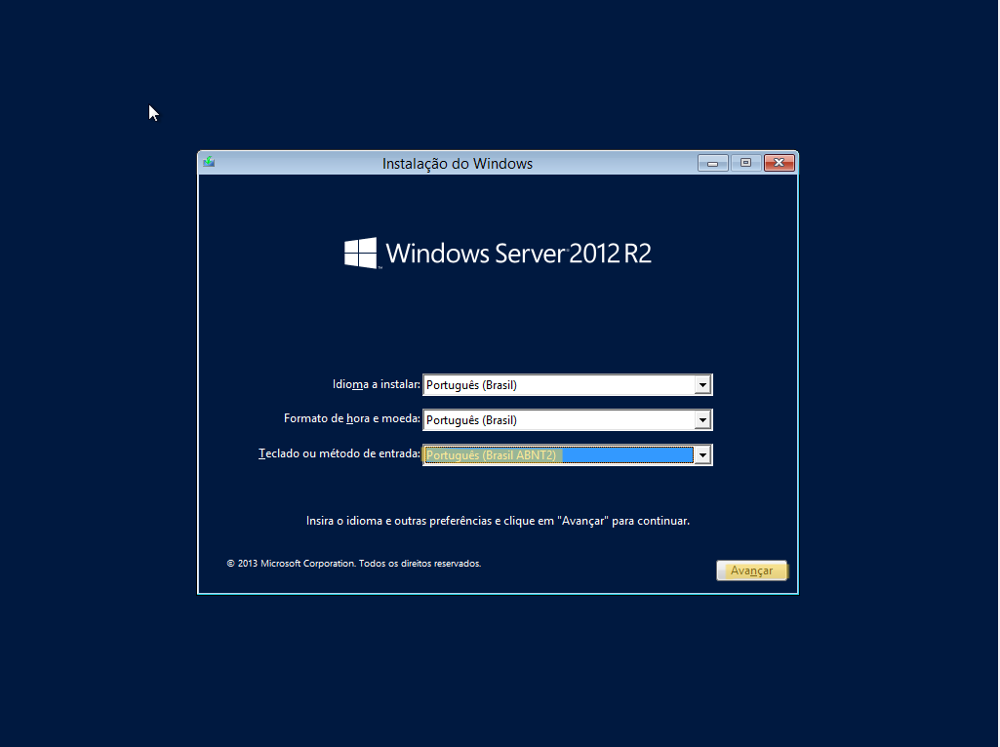

# PASSO 2 
### Instale o Windows server 2012.
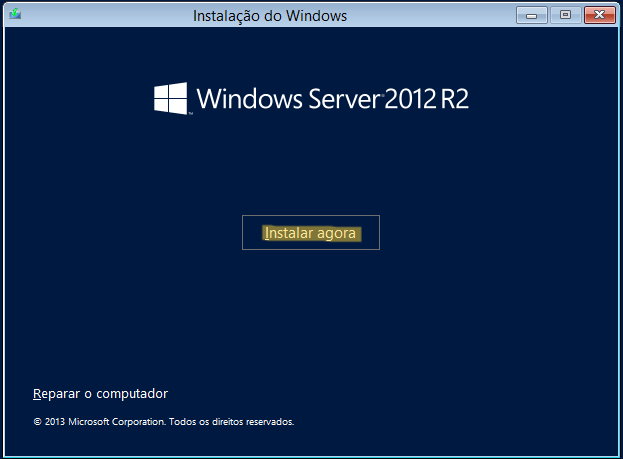

# PASSO 3 
### Escolha o segundo Sistema operacional e avance.
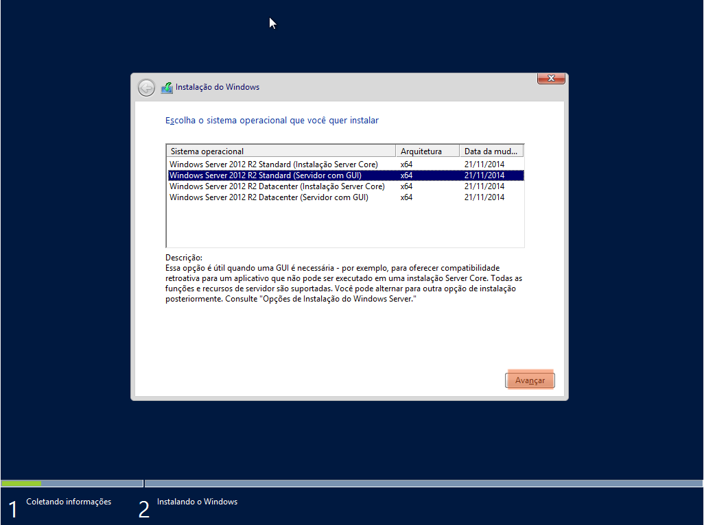

# PASSO 4
### Aceite os termos de licença e avance.
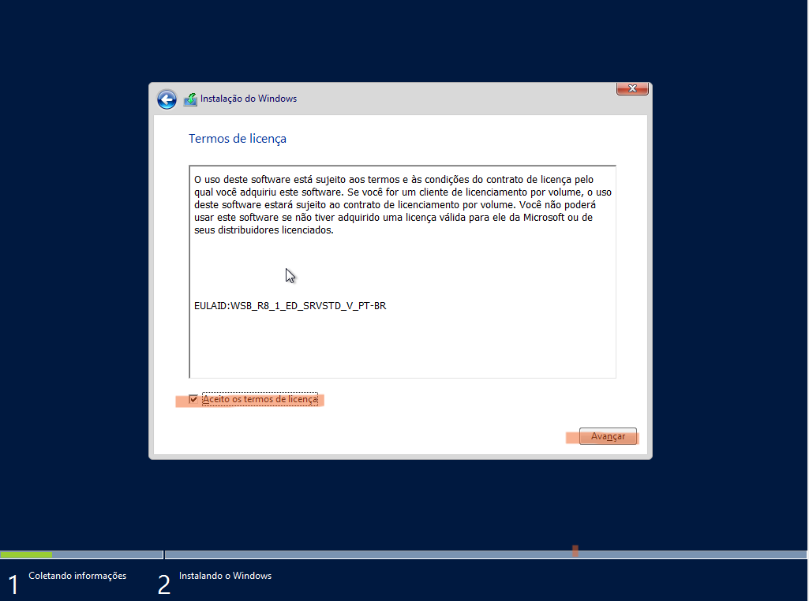

# PASSO 5
### Escolha a opção "Personalizada".
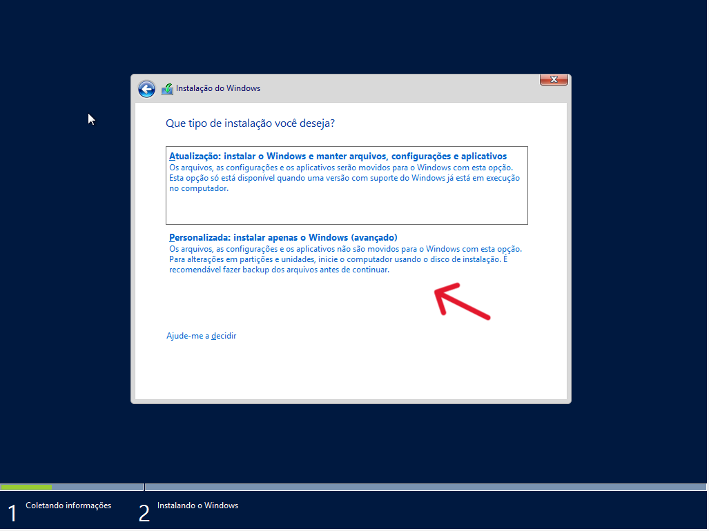

# PASSO 6
### Avance.
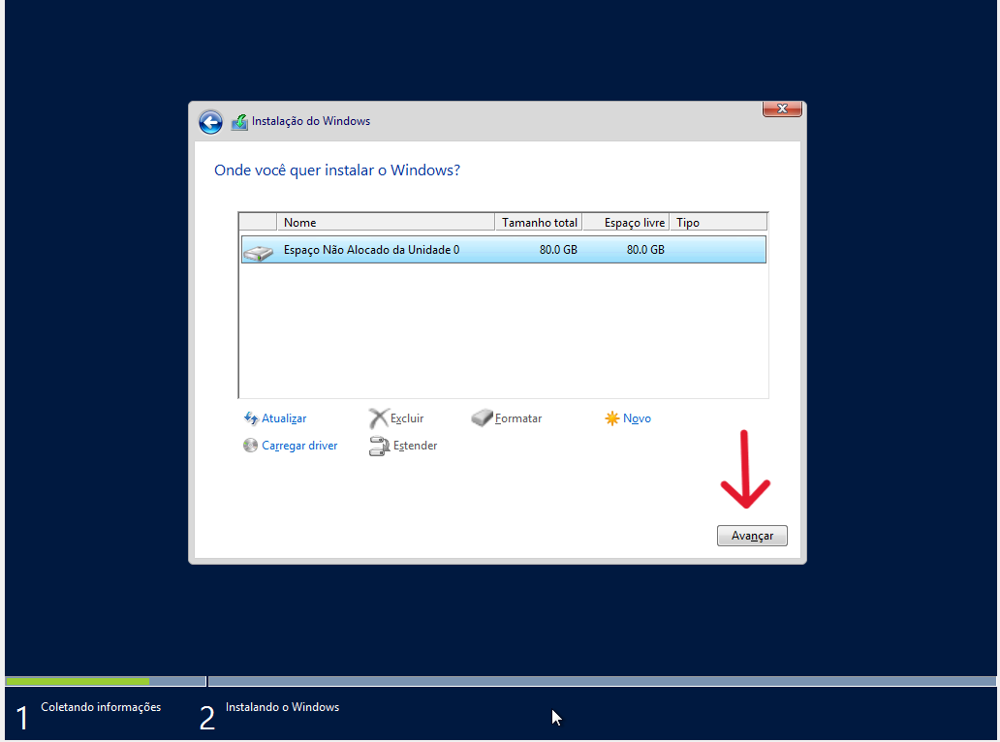

# PASSO 7 
### Aperte CRTL + DELETE, após isso, digite sua senha.
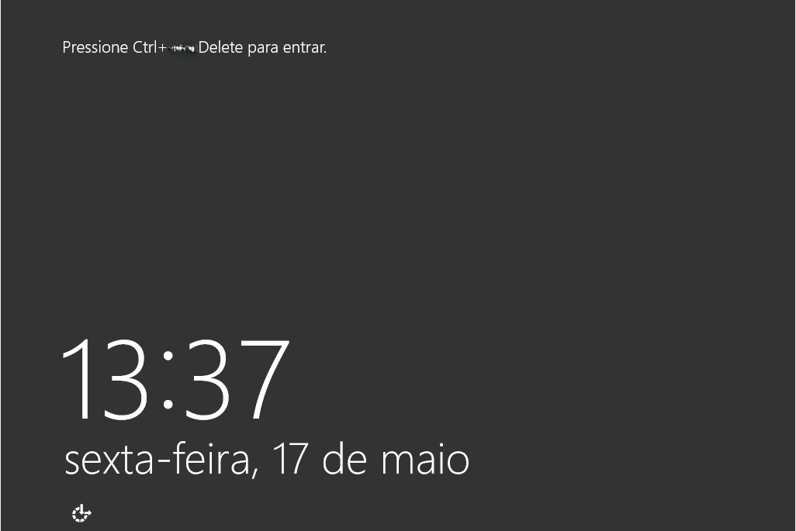

# PASSO 8
### Clique em "dispositivos"
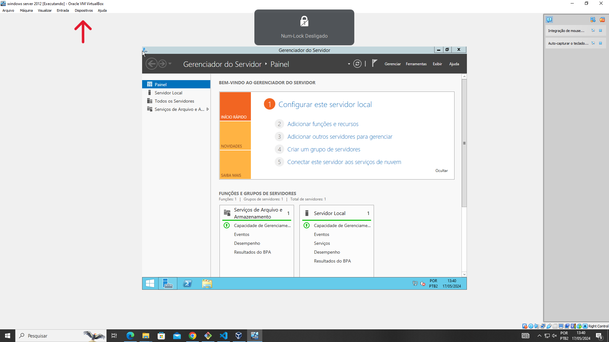

# PASSO 9
### Clique duas vezes em "Unidade de CD"
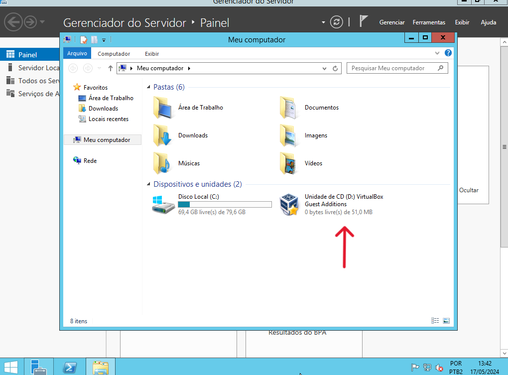

# PASSO 10
### Abra o arquivo indicado na imagem. 
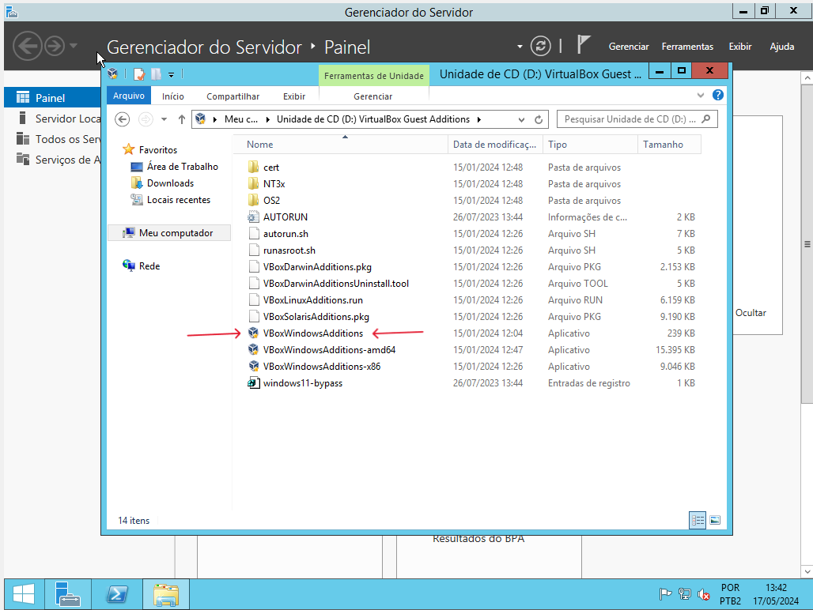

# PASSO 11
### Clique em "Next"
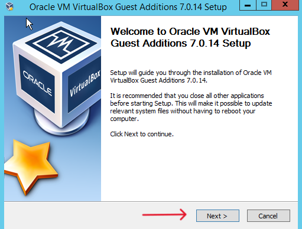

# PASSO 12
### Clique em "Next"
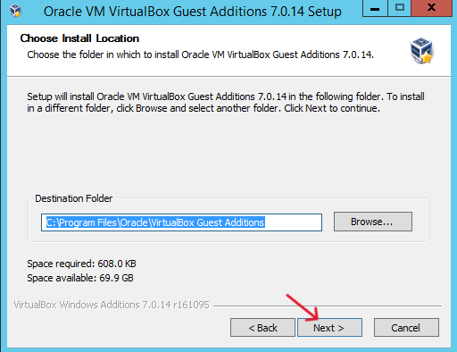

# PASSO 13
### Clique em "Instal"
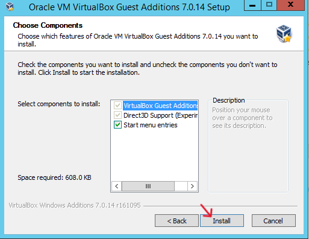

# PASSO 14
### Clique em "Instalar"
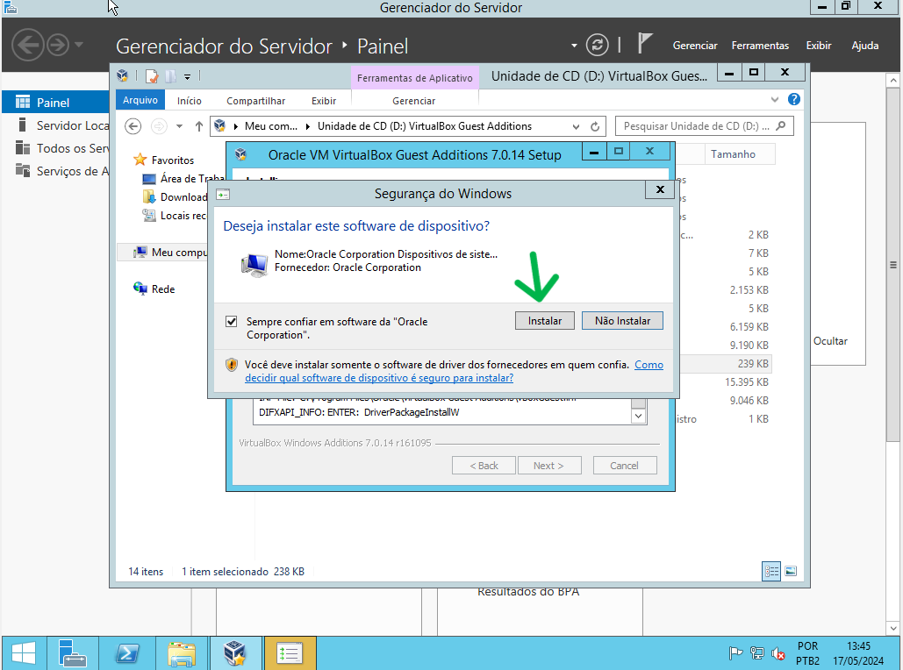

# PASSO 15
### Clique em "Finish"
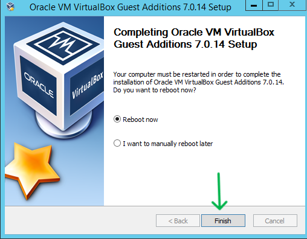

# PASSO 16
### Insira sua senha.

# PASSO 17
### Clique em "CNTRL + F" para COLOCAR em tela cheia.
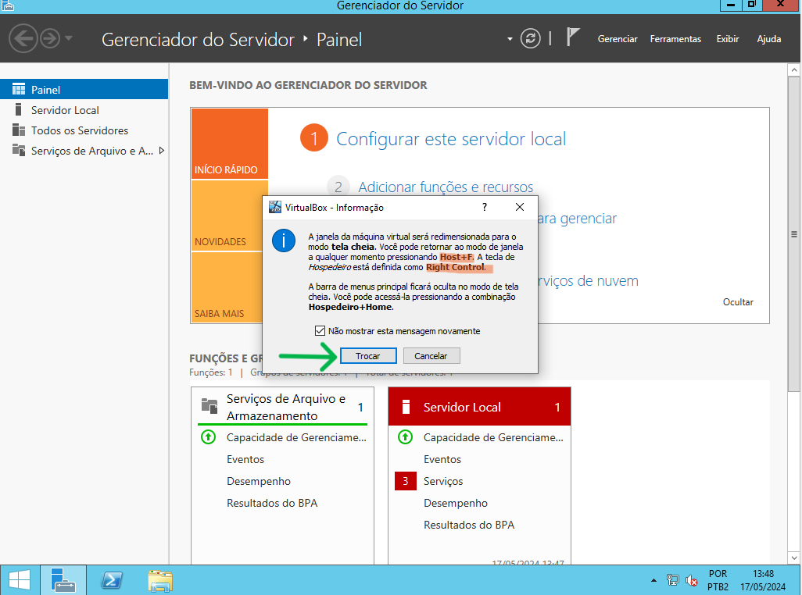

# PASSO 18
### Clique em "CNTRL + C" para TIRAR da tela cheia.
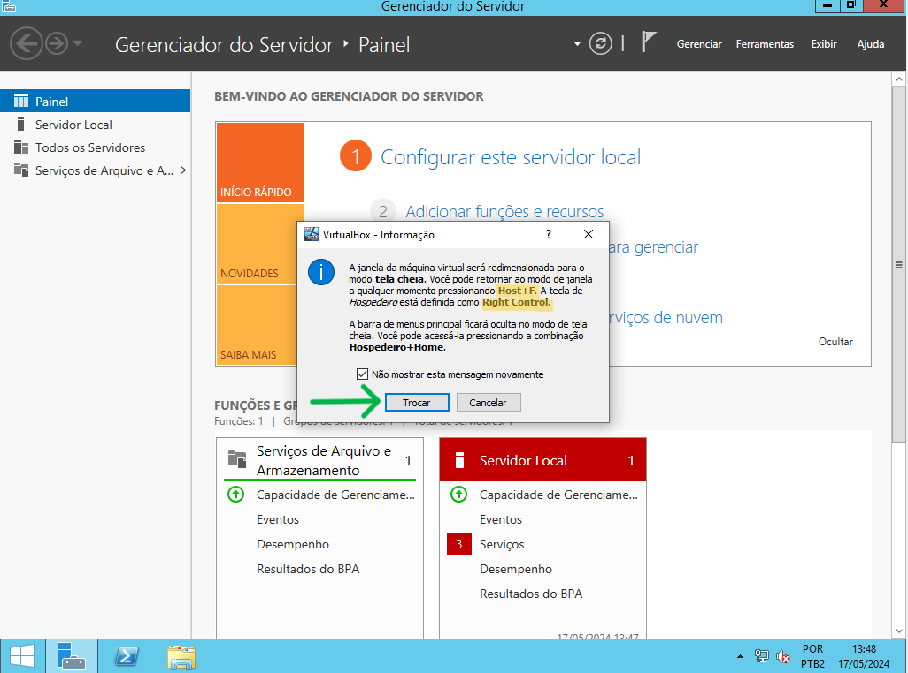